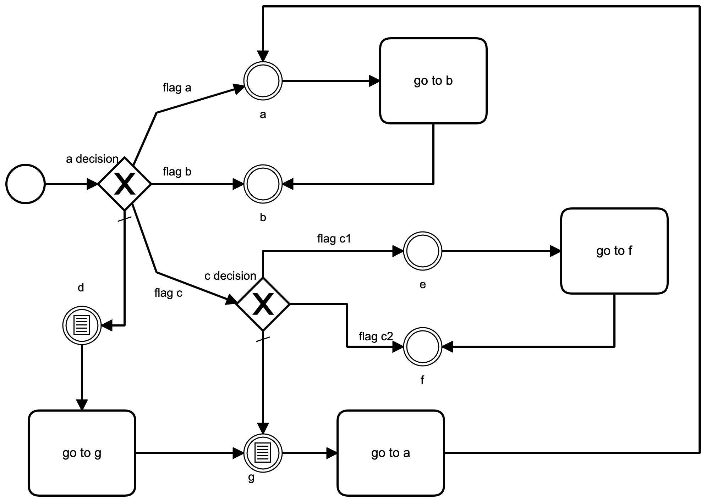

# cl-statemachine-to-c++

_Mihai Cristian Tănase <mihaicristian.tanase@gmail.com>_

This is a project to generate a StateMachine C++ class from a state machine described in Common Lisp.

## License

[MIT License](LICENSE.md)

## Usage

From the  following BMPN diagram:


*manually* writing the the following code

```lisp
(ql:quickload "cl-statemachine-to-c++")

(defparameter machine
  (make-instance
   'cl-statemachine-to-c++:Machine
   :context 'demo-ex
   :states '((a-decision
              (flag-a . a)
              (flag-b . b)
              (flag-c . c-decision)
              d)
             a
             b
             (c-decision
              (flag-c1 . e)
              (flag-c2 . f)
              g)
             d
             e
             f
             g)
   :transitions '((d go-to-g g)
                  (g go-to-a a)
                  (g execute-something nil)
                  (a go-to-b b)
                  (e go-to-f f))))

(cl-statemachine-to-c++:save-and-check-c++ machine
  "/tmp/Machine.hpp"
  "/tmp/MachineTest.cpp")
```

* generates the main state machine file at `/tmp/Machine.hpp`:

```c++
//
// This file is generated with cl-statemachine-to-c++
// Changes are not recommended.
//

#include <iostream>
#include <functional>
#include <exception>

class StateMachine {
public:
  /**
   * The states of the state machine. A state fully defines properties necessary to decide user actions.
   */
  enum State {
      kStateADecision,
      kStateA,
      kStateB,
      kStateCDecision,
      kStateD,
      kStateE,
      kStateF,
      kStateG,
  };

  static std::string enumNameForState(State item) {
    switch (item) {
      case kStateADecision:
      return "State.kStateADecision";
      case kStateA:
      return "State.kStateA";
      case kStateB:
      return "State.kStateB";
      case kStateCDecision:
      return "State.kStateCDecision";
      case kStateD:
      return "State.kStateD";
      case kStateE:
      return "State.kStateE";
      case kStateF:
      return "State.kStateF";
      case kStateG:
      return "State.kStateG";
    }

  };

  /**
   * The actions of the state machine. An action connects two states.
   */
  enum Action {
      kActionExecuteSomething,
      kActionGoToA,
      kActionGoToB,
      kActionGoToF,
      kActionGoToG,
  };

  static std::string enumNameForAction(Action item) {
    switch (item) {
      case kActionExecuteSomething:
      return "Action.kActionExecuteSomething";
      case kActionGoToA:
      return "Action.kActionGoToA";
      case kActionGoToB:
      return "Action.kActionGoToB";
      case kActionGoToF:
      return "Action.kActionGoToF";
      case kActionGoToG:
      return "Action.kActionGoToG";
    }

  };

  enum ErrId {
      kErrIdSuccess,
      kErrIdImpossibleAction,
      kErrIdTransitionNotSet,
      kErrIdInvalidTransition,
      kErrIdInvalidDecision,
      kErrIdGeneralError,
  };

  static std::string enumNameForErrId(ErrId item) {
    switch (item) {
      case kErrIdSuccess:
      return "ErrId.kErrIdSuccess";
      case kErrIdImpossibleAction:
      return "ErrId.kErrIdImpossibleAction";
      case kErrIdTransitionNotSet:
      return "ErrId.kErrIdTransitionNotSet";
      case kErrIdInvalidTransition:
      return "ErrId.kErrIdInvalidTransition";
      case kErrIdInvalidDecision:
      return "ErrId.kErrIdInvalidDecision";
      case kErrIdGeneralError:
      return "ErrId.kErrIdGeneralError";
    }

  };

  typedef std::function<void(bool, std::exception*)> Completion;
  typedef std::function<void(Completion)> ActionExecutor;
  typedef std::tuple<State, Action, State> Transition;
  typedef std::function<bool()> Decision;

  class Err : public std::exception {
  public:
    ErrId err;
    std::string message;

    Err() : err(kErrIdSuccess) {
    }

    Err(ErrId err, State state, Action action) : err(err) {
      this->message = enumNameForErrId(err) +
      " state:" + enumNameForState(state) +
      " action:" + enumNameForAction(action);
    }

    Err(std::string message) : err(kErrIdGeneralError) {
      this->message = enumNameForErrId(err) + " " + message;
    }

    Err(const char* message) : err(kErrIdGeneralError) {
      this->message = enumNameForErrId(err) + " " +std::string(message);
    }

    virtual const char* what() const noexcept {
      return message.c_str();
    }

  };

  bool isLogEnabled = false;

  static StateMachine create() {
    return StateMachine(kStateADecision);
  }

  /**
   * Description of the error from last action.
   */
  std::string errorDescription() {
    if (lastActionError) {
      const char* rv = lastActionError->what();
      return std::string(rv);
    }

    return "";
  }

  /**
   * Set decision for isFlagA
   */
  void setDecisionFlagA(Decision decision) {
    isFlagA = decision;
  }

  /**
   * Set decision for isFlagB
   */
  void setDecisionFlagB(Decision decision) {
    isFlagB = decision;
  }

  /**
   * Set decision for isFlagC
   */
  void setDecisionFlagC(Decision decision) {
    isFlagC = decision;
  }

  /**
   * Set decision for isFlagC1
   */
  void setDecisionFlagC1(Decision decision) {
    isFlagC1 = decision;
  }

  /**
   * Set decision for isFlagC2
   */
  void setDecisionFlagC2(Decision decision) {
    isFlagC2 = decision;
  }

  /**
   * Set action kActionExecuteSomething
   */
  void setActionExecuteSomething(ActionExecutor action) {
    actionExecuteSomething = action;
  }

  /**
   * Execute action kActionExecuteSomething from current state
   */
  void doActionExecuteSomething(Completion completion) {
    log("doActionExecuteSomething");
    doAction(kActionExecuteSomething, completion);
  }

  /**
   * Set action kActionGoToA
   */
  void setActionGoToA(ActionExecutor action) {
    actionGoToA = action;
  }

  /**
   * Execute action kActionGoToA from current state
   */
  void doActionGoToA(Completion completion) {
    log("doActionGoToA");
    doAction(kActionGoToA, completion);
  }

  /**
   * Set action kActionGoToB
   */
  void setActionGoToB(ActionExecutor action) {
    actionGoToB = action;
  }

  /**
   * Execute action kActionGoToB from current state
   */
  void doActionGoToB(Completion completion) {
    log("doActionGoToB");
    doAction(kActionGoToB, completion);
  }

  /**
   * Set action kActionGoToF
   */
  void setActionGoToF(ActionExecutor action) {
    actionGoToF = action;
  }

  /**
   * Execute action kActionGoToF from current state
   */
  void doActionGoToF(Completion completion) {
    log("doActionGoToF");
    doAction(kActionGoToF, completion);
  }

  /**
   * Set action kActionGoToG
   */
  void setActionGoToG(ActionExecutor action) {
    actionGoToG = action;
  }

  /**
   * Execute action kActionGoToG from current state
   */
  void doActionGoToG(Completion completion) {
    log("doActionGoToG");
    doAction(kActionGoToG, completion);
  }

  /**
   * Inspect the current state.
   */
  State getState() {
    return state;
  }

  /**
   * Inspect the last action executed.
   */
  Action getLastAction() {
    return lastAction;
  }

  /**
   * Inspect the last action error.
   */
  std::exception* getLastActionError() {
    return lastActionError;
  }

  /**
   * Start method. Must be called, otherwise, the state machine is not running.
   */
  void start() {
    // check decisions
    if (!isFlagA) {
      throw Err("Machine not started because decision 'flagA' is missing");
    }

    if (!isFlagB) {
      throw Err("Machine not started because decision 'flagB' is missing");
    }

    if (!isFlagC) {
      throw Err("Machine not started because decision 'flagC' is missing");
    }

    if (!isFlagC1) {
      throw Err("Machine not started because decision 'flagC1' is missing");
    }

    if (!isFlagC2) {
      throw Err("Machine not started because decision 'flagC2' is missing");
    }


    // check actions
    if (!actionExecuteSomething) {
      throw Err("Machine not started because action 'executeSomething' is missing");
    }

    if (!actionGoToA) {
      throw Err("Machine not started because action 'goToA' is missing");
    }

    if (!actionGoToB) {
      throw Err("Machine not started because action 'goToB' is missing");
    }

    if (!actionGoToF) {
      throw Err("Machine not started because action 'goToF' is missing");
    }

    if (!actionGoToG) {
      throw Err("Machine not started because action 'goToG' is missing");
    }


    // start the machine
    try {
      moveToState(state);
    }

    catch (std::exception& e) {
      throw std::runtime_error(e.what());
    }

  }

private:
  /**
   * Flag to indicate whether or not this class prints debugging messages.
   */
  /**
   * Current state.
   */
  State state;

  /**
   * Last action.
   */
  Action lastAction;

  /**
   * Last action error.
   */
  std::exception* lastActionError = NULL;

  /**
   * Actions
   */
  ActionExecutor actionExecuteSomething;
  ActionExecutor actionGoToA;
  ActionExecutor actionGoToB;
  ActionExecutor actionGoToF;
  ActionExecutor actionGoToG;

  /**
   * Decisions
   */
  Decision isFlagA;
  Decision isFlagB;
  Decision isFlagC;
  Decision isFlagC1;
  Decision isFlagC2;

  /**
   * Transitions
   */
  Transition transitions[5] = {
    {kStateD, kActionGoToG, kStateG},
    {kStateG, kActionGoToA, kStateA},
    {kStateG, kActionExecuteSomething, kStateG},
    {kStateA, kActionGoToB, kStateB},
    {kStateE, kActionGoToF, kStateF},
  };

  StateMachine(State state) {
    this->state = state;
  }

  void  doAction(Action action, Completion completion) {
    lastAction = action;

    ActionExecutor actionExec;
    switch (action) {
      case kActionExecuteSomething:
      actionExec = actionExecuteSomething;
      break;
      case kActionGoToA:
      actionExec = actionGoToA;
      break;
      case kActionGoToB:
      actionExec = actionGoToB;
      break;
      case kActionGoToF:
      actionExec = actionGoToF;
      break;
      case kActionGoToG:
      actionExec = actionGoToG;
      break;
    }

    try {
      Transition transition = findTransition(action);
      if (!actionExec) {
        throw Err(kErrIdTransitionNotSet, state, action);
      }
      actionExec([&](bool success, std::exception* actionException) {
        if (!success) {
          lastActionError = actionException;
          completion(false, actionException);
          return;
        }

        try {
          moveToState(std::get<2>(transition));
          lastActionError = actionException;
          completion(success, actionException);
        } catch (std::exception& e) {
          lastActionError = &e;
          completion(false, &e);
        }

      }

      );
    } catch (std::exception& e) {
      lastActionError = &e;
      completion(false, &e);
    }

  }

  Transition findTransition(Action action) {
    for (auto cand : transitions) {
      if (std::get<0>(cand) == state && std::get<1>(cand) == action) {
        return cand;
      }
    }

    throw Err(kErrIdImpossibleAction, state, action);
  }

  void moveToState(State state) {
    this->state = state;
    log("moveToState " + enumNameForState(state));

    switch (state) {
      case kStateADecision:
      if (isFlagA()) {
        moveToState(kStateA);
      }

      else if (isFlagB()) {
        moveToState(kStateB);
      }

      else if (isFlagC()) {
        moveToState(kStateCDecision);
      }

      else {
        moveToState(kStateD);
      }

      break;
      case kStateA:
      break;
      case kStateB:
      break;
      case kStateCDecision:
      if (isFlagC1()) {
        moveToState(kStateE);
      }

      else if (isFlagC2()) {
        moveToState(kStateF);
      }

      else {
        moveToState(kStateG);
      }

      break;
      case kStateD:
      break;
      case kStateE:
      break;
      case kStateF:
      break;
      case kStateG:
      break;
    }

  }

  void log(std::string msg) {
    if (isLogEnabled) {
      std::cout << "StateMachine: " << msg << std::endl;
    }

  }

};
```

* and the usage file at `/tmp/MachineTest.cpp`:

```c++
#include "Machine.hpp"

class StateMachineTest {
public:
  void test() {
    StateMachine sm = StateMachine::create();
    sm.isLogEnabled = true;
    sm.setDecisionFlagA([&]() { /*TODO*/ return tautology(); });
    sm.setDecisionFlagB([&]() { /*TODO*/ return tautology(); });
    sm.setDecisionFlagC([&]() { /*TODO*/ return tautology(); });
    sm.setDecisionFlagC1([&]() { /*TODO*/ return tautology(); });
    sm.setDecisionFlagC2([&]() { /*TODO*/ return tautology(); });
    sm.setActionExecuteSomething([&](StateMachine::Completion completion) { executeSomethingDemoEx(completion); });
    sm.setActionGoToA([&](StateMachine::Completion completion) { goToADemoEx(completion); });
    sm.setActionGoToB([&](StateMachine::Completion completion) { goToBDemoEx(completion); });
    sm.setActionGoToF([&](StateMachine::Completion completion) { goToFDemoEx(completion); });
    sm.setActionGoToG([&](StateMachine::Completion completion) { goToGDemoEx(completion); });
    sm.start();

    std::cout << "-- This returns a specific exception:" << std::endl;
    sm.doActionExecuteSomething([&](bool success, std::exception* e) {
      std::cout << "-- success:" << success << std::endl;
      std::cout << "-- error:" << sm.errorDescription() << std::endl;
    }

    );
    std::cout << "-- This moves through various states:" << std::endl;
    sm.doActionGoToB([&](bool success, std::exception* e) {
      std::cout << "-- success:" << success << std::endl;
    }

    );
  }

private:
  void executeSomethingDemoEx(StateMachine::Completion completion) {
    // TODO: add logic for executeSomethingDemoEx
    completion(true, NULL);
  }

  void goToADemoEx(StateMachine::Completion completion) {
    // TODO: add logic for goToADemoEx
    completion(true, NULL);
  }

  void goToBDemoEx(StateMachine::Completion completion) {
    // TODO: add logic for goToBDemoEx
    completion(true, NULL);
  }

  void goToFDemoEx(StateMachine::Completion completion) {
    // TODO: add logic for goToFDemoEx
    completion(true, NULL);
  }

  void goToGDemoEx(StateMachine::Completion completion) {
    // TODO: add logic for goToGDemoEx
    completion(true, NULL);
  }

  bool tautology() {
    return true;
  }

};

int main(int argc, char** argv) {
  StateMachineTest().test();
  return 0;
}
```

## TODO

1. Generate the Machine object automatically by parsing the BMPN diagram;

1. Beautify code (ex: join "else", "catch" lines);

1. Remove trailing white spaces;

1. Cleanup Common Lisp code;
